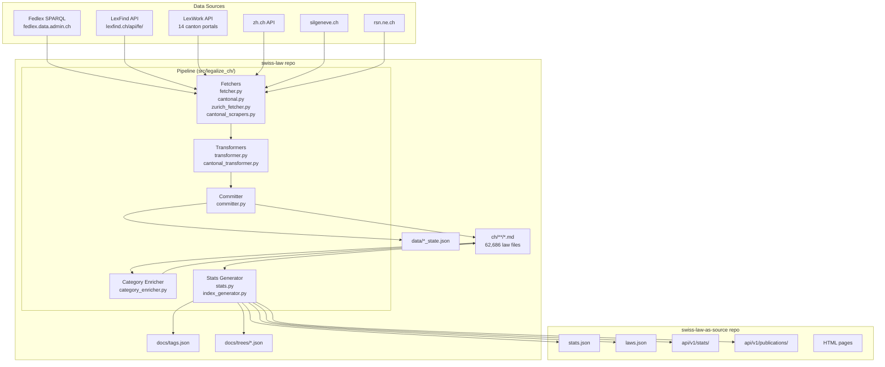
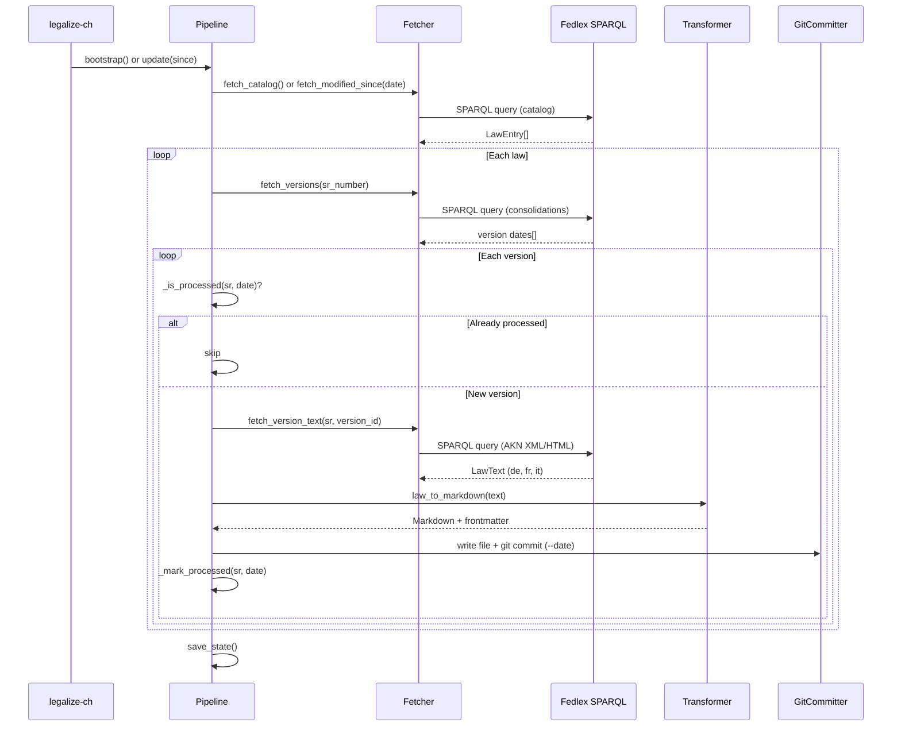
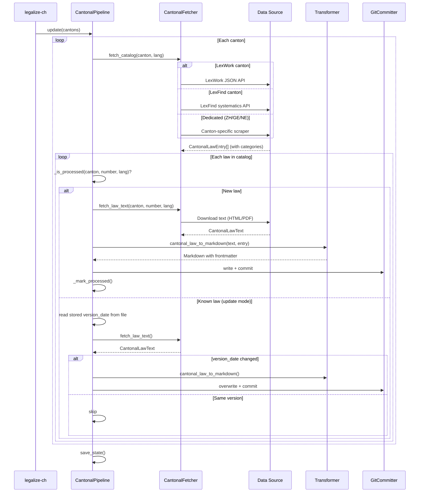
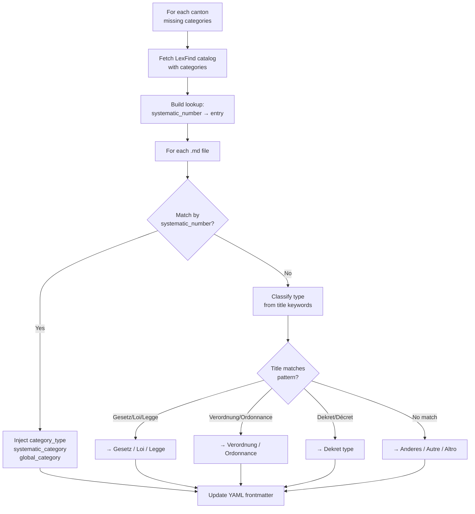
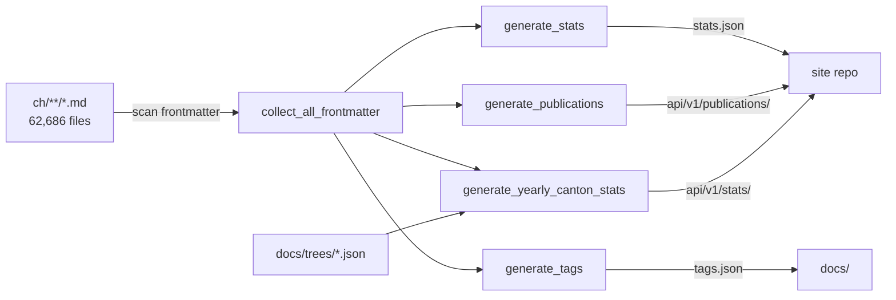
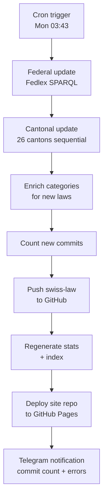

# Architecture

Technical documentation for the swiss-law pipeline.

## System overview



## Module map

| Module | Purpose |
|--------|---------|
| `cli.py` | Click CLI entry point — all commands |
| `fetcher.py` | Fedlex SPARQL client — catalog, versions, text |
| `cantonal.py` | Cantonal data fetcher — LexWork API, LexFind catalog + PDF, data models |
| `zurich_fetcher.py` | ZH dedicated fetcher (zh.ch JSON API) |
| `cantonal_scrapers.py` | GE + NE dedicated HTML scrapers |
| `pipeline.py` | Federal pipeline orchestrator (fetch → transform → commit) |
| `cantonal_pipeline.py` | Cantonal pipeline orchestrator |
| `transformer.py` | Federal law AKN XML/HTML → Markdown conversion |
| `cantonal_transformer.py` | Cantonal HTML/PDF text → Markdown conversion |
| `committer.py` | Git operations (add, commit with date, env setup) |
| `category_enricher.py` | Back-fill LexFind category metadata into existing files |
| `stats.py` | Statistics generation (counts, breakdowns, trees, publications) |
| `index_generator.py` | INDEX.md and laws.json generation |
| `cross_level_refs.py` | Federal ↔ cantonal cross-reference detection |
| `rss_feed.py` | RSS/Atom feed generation |
| `api.py` | FastAPI REST server |
| `models.py` | Shared data models (LawEntry, LawRevision, LawText) |
| `exporter.py` | CSV / JSON-LD export |
| `notify.py` | Telegram notification |
| `health_check.py` | Staleness check + alerting |
| `validator.py` | Markdown/frontmatter validation |

## Federal pipeline



### State tracking

**File**: `data/pipeline_state.json`

```json
{
  "processed": {
    "101@2024-03-03": true,
    "210@2023-01-15": true
  },
  "last_run": "2026-06-15"
}
```

- Key format: `{sr_number}@{version_date}`
- `last_run`: used by `update` to query Fedlex for laws modified since this date
- Fedlex SPARQL supports `dateApplicability >= since` filtering

## Cantonal pipeline



### State tracking

**File**: `data/cantonal_pipeline_state.json`

```json
{
  "processed": {
    "bs/300.100@de": true,
    "ge/A 1 01@fr": true
  },
  "last_run": "2026-06-15"
}
```

- Key format: `{canton}/{systematic_number}@{lang}`
- No date-based filtering (cantonal sources don't support it)
- Update mode: re-fetches catalog, compares `version_date` for known laws

## Category enrichment



### Title keyword classifier

The fallback classifier (`category_enricher.py`) maps title keywords to instrument types in three languages:

| Pattern (regex) | Category type |
|-----------------|---------------|
| `\bVerfassung\b` | Verfassung |
| `\bGesetz\b` | Gesetz |
| `\bVerordnung\b` | Verordnung |
| `\bDekret\b` | Verordnung des Parlaments (Dekret) |
| `\bReglement\b` | Reglement |
| `\bKonkordat\b` | Interkantonale Vereinbarung |
| `\bConstitution\b` | Constitution |
| `\bLoi\b` | Loi |
| `\bOrdonnance\b` | Ordonnance |
| `\bDécret\b` | Ordonnance parlementaire (décret) |
| `\bRèglement\b` | Règlement |
| `\bCostituzione\b` | Costituzione |
| `\bLegge\b` | Legge |
| `\bOrdinanza\b` | Ordinanza |

40+ patterns total. Ordered by specificity (longest/most specific first).

## Data source details

### Federal: Fedlex SPARQL

- **Endpoint**: `https://fedlex.data.admin.ch/sparqlendpoint`
- **Ontology**: JoLux (Swiss legal ontology)
- **Queries**: Catalog (all laws), versions (consolidation dates per law), text (AKN XML/HTML per version)
- **Pagination**: 5,000 results per page
- **Incremental**: Supports `dateApplicability >= since` filter

### Cantonal: LexFind

- **API**: `https://www.lexfind.ch/api/fe/{lang}/entities/{id}/systematics`
- **Provides**: Catalog + category metadata for all 26 cantons
- **PDF endpoint**: `https://www.lexfind.ch/tol/{tol_id}/{lang}` (PDF download)
- **Text extraction**: `pdftotext -layout` (system command)
- **Category tree**: Per-canton systematic categories + global "domaine juridique"

### Cantonal: LexWork

- **Hosts**: 14 different canton-specific domains (e.g. `gesetzessammlungen.ag.ch`)
- **API pattern**: `/api/tol/{number}?format=json&lang={lang}`
- **Provides**: Law text as XHTML, title, abbreviation, version dates
- **No categories** (enriched from LexFind separately)

### Cantonal: Dedicated scrapers

| Canton | Source | Method |
|--------|--------|--------|
| ZH | `zh.ch` JSON cache | Fetches catalog JSON + HTML detail pages |
| GE | `silgeneve.ch/legis/` | HTML scrape of RSG catalog + law pages (latin-1) |
| NE | `rsn.ne.ch/DATA/` | HTML scrape (same pattern as GE) |

## Statistics generation



### Output breakdown

| Output | Count | Description |
|--------|-------|-------------|
| `stats.json` | 1 file | Aggregate: by language, source, canton, category, year, cross-tabs |
| `tags.json` | 1 file (22 MB) | Every law with all metadata fields |
| `trees/*.json` | 28 files | Category taxonomies (26 cantons + ch + global) |
| `api/v1/stats/` | ~2,150 files | `{year}/{canton}.json` with topic tree annotations |
| `api/v1/publications/` | ~215 files | `{year}.json` with law lists |
| `laws.json` | 1 file (4.4 MB) | Searchable index for website |

## Scripts

| Script | Purpose | Schedule |
|--------|---------|----------|
| `weekly_update.sh` | Full automated update + push + notify | Cron: Mon 03:43 |
| `update_all.sh` | Manual incremental update (optional push) | On demand |
| `fetch_missing_cantons.sh` | Bootstrap missing cantons (one-time) | One-time |
| `deploy_site.sh` | Commit + push site repo | Called by weekly_update |
| `health_check.sh` | Alert if no commits for N days | Cron |

### Weekly update flow



## Git commit conventions

- **Federal law commits**: Author date set to consolidation date of the law version
- **Cantonal law commits**: Author date set to `version_date` from the law text
- **Commit message format**: `{SR_NUMBER}: {title} ({date})` or `{CANTON} {number}: {title} ({date})`
- **Infrastructure commits**: Normal dates, Co-Authored-By header for AI-assisted changes

Example git log for a single law:
```
$ git log --oneline --follow ch/de/220.md
a1b2c3d 220: Schweizerisches Zivilgesetzbuch (2024-01-01)
d4e5f6a 220: Schweizerisches Zivilgesetzbuch (2023-01-01)
7890abc 220: Schweizerisches Zivilgesetzbuch (2022-01-01)
...
```
