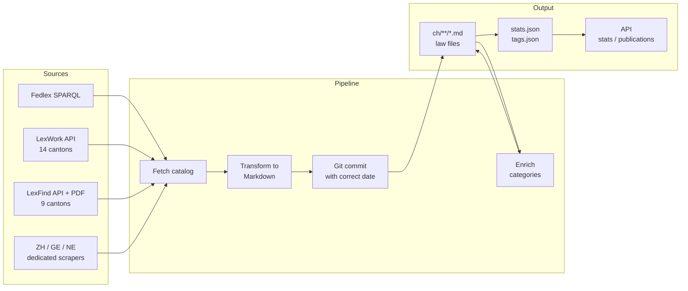
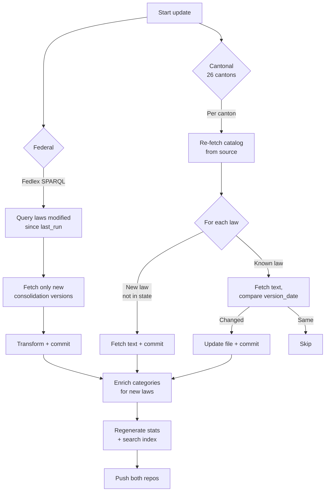

# Swiss Law — Version-Controlled

Every Swiss federal and cantonal law in Markdown, with a full git history of every amendment.

## At a glance

| Scope | Unique laws | Languages |
|-------|-------------|-----------|
| Federal (SR) | 9,038 | DE, FR, IT |
| Cantonal (26 cantons) | 21,000+ | DE, FR, IT |
| **Total** | **30,000+** | |

65,000+ language-version files, 59,600+ git commits. Updated weekly.
(Counts are deduplicated: one law counted once regardless of language versions — see `stats.json`.)

## How it works



1. Fetches law catalogs from official Swiss sources
2. Downloads law text (HTML, XML, or PDF) and converts to clean Markdown with YAML frontmatter
3. Commits each version with the correct author-date, so `git log` shows the legislative timeline
4. Enriches cantonal laws with LexFind category metadata (instrument type, topic, legal domain)
5. Generates statistics, search index, and per-year per-canton breakdowns

## Repository structure

This project uses two repositories:

| Repo | Purpose | Contents |
|------|---------|----------|
| **swiss-law** (this repo) | Law text + pipeline code | `ch/` (markdown files), `src/`, `scripts/`, `docs/tags.json`, `docs/trees/` |
| **[swiss-law-as-source](https://github.com/swiss-law-as-source/swiss-law-as-source.github.io)** | Website + statistics API | `stats.json`, `laws.json`, `api/v1/`, HTML pages |

```
swiss-law/
├── ch/
│   ├── 0/de/0.101.md          # Federal: SR 0.xxx (international treaties)
│   ├── 1/de/101.md            # Federal: SR 1xx (constitutional law)
│   ├── ...                    # Federal: SR 2xx-9xx
│   ├── ag/de/110.000.md       # Cantonal: Aargau
│   ├── be/de/101.1.md         # Cantonal: Bern
│   ├── ...                    # 26 cantons
│   └── zh/de/101.md           # Cantonal: Zurich
├── src/legalize_ch/           # Pipeline source code
├── scripts/                   # Operational scripts
├── data/                      # Pipeline state (not committed)
└── docs/
    ├── tags.json              # Complete law index with metadata
    └── trees/                 # LexFind category taxonomies (28 JSON files)
```

## Frontmatter schema

**Federal law** (`ch/{sr_prefix}/{lang}/{sr_number}.md`):

```yaml
---
sr_number: '101'
title: Bundesverfassung der Schweizerischen Eidgenossenschaft
abbreviation: BV
language: de
version_date: '2024-03-03'
source: https://fedlex.data.admin.ch
---
```

**Cantonal law** (`ch/{canton}/{lang}/{systematic_number}.md`):

```yaml
---
canton: BS
systematic_number: '300.100'
title: Gesundheitsgesetz
abbreviation: GesG
language: de
category_type: Gesetz
systematic_category: 30 Gesundheit
global_category: 8.10.60 Spitalexterne Krankenpflege
version_date: '2025-01-01'
source: LexWork
---
```

| Field | Scope | Description |
|-------|-------|-------------|
| `sr_number` | Federal | Systematic number in the SR classification |
| `canton` | Cantonal | Two-letter canton code (e.g. BS, ZH) |
| `systematic_number` | Cantonal | Canton-specific numbering |
| `category_type` | Cantonal | Instrument type: Gesetz, Verordnung, Loi, Ordonnance, ... |
| `systematic_category` | Cantonal | Canton topic tree node (e.g. "30 Gesundheit") |
| `global_category` | Cantonal | Cross-canton legal domain (e.g. "8.10.60 Spitalexterne Krankenpflege") |
| `version_date` | Both | Date of the current consolidated version |
| `source` | Both | Data source identifier |

## Data sources

### Canton source map

| Source | Cantons | Method | Languages |
|--------|---------|--------|-----------|
| **LexWork API** | AG, AR, BE, BL, BS, FR, GL, GR, LU, SG, SO, TG, VS, ZG | JSON REST API | de (+fr for BE/FR/VS, +it/rm for GR) |
| **LexFind PDF** | AI, JU, NW, OW, SH, SZ, TI, UR, VD | PDF download + `pdftotext` extraction | de/fr/it per canton |
| **ZH dedicated** | ZH | zh.ch JSON API | de |
| **GE dedicated** | GE | silgeneve.ch HTML scraper | fr |
| **NE dedicated** | NE | rsn.ne.ch HTML scraper | fr |
| **Fedlex SPARQL** | (federal) | SPARQL endpoint + AKN XML/HTML | de, fr, it |

All cantons get their **catalog and category metadata** from [LexFind](https://www.lexfind.ch/) regardless of text source.

## Incremental updates



The pipeline tracks state in `data/pipeline_state.json` (federal) and `data/cantonal_pipeline_state.json` (cantonal). Each processed law is recorded so subsequent runs only fetch new or changed content.

## Usage

### Browse law history

```bash
git log --follow ch/de/142.20.md          # Federal: Immigration Act amendments
git log --follow ch/bs/de/300.100.md      # Cantonal: Basel-Stadt health law
git log --after="2024-01-01" --oneline    # All changes since 2024
```

### Get a law at a point in time

```bash
git log --before="2015-06-01" -1 --format="%H" -- ch/de/220.md | xargs git show | head -50
```

### Run the pipeline

```bash
pip install -e .

# Full bootstrap (initial fetch)
legalize-ch bootstrap --scope all              # Federal + all 26 cantons
legalize-ch bootstrap --scope cantonal -c zh   # Single canton

# Incremental update
legalize-ch update --scope all                 # Everything since last run
legalize-ch update --scope cantonal -c bs      # Single canton

# Enrich categories
legalize-ch enrich-categories                  # Back-fill LexFind metadata

# Generate statistics
legalize-ch stats                              # stats.json, tags.json, API files
legalize-ch index                              # laws.json search index
```

### Automated weekly update

```bash
./scripts/update_all.sh              # Update all sources, no push
./scripts/update_all.sh 0.5 --push   # Update + push both repos
```

The website (https://swiss-law-as-source.github.io) is intentionally minimal: `index.html` is the interactive statistics dashboard, `laws.html` the per-entity law browser (with cross-entity search), `api.html` the Swagger/OpenAPI explorer — everything else is JSON under `/api/v1/`.

The cron job (`scripts/weekly_update.sh`) runs every Monday at 03:43, updates everything, pushes to GitHub, and sends a Telegram notification. It is **self-healing**: after the per-canton updates it runs `backfill-lexfind` (all 26 cantons, add-only — any law of any type that appears in a LexFind catalog gets fetched within a week) and a `coverage` audit that publishes `api/v1/coverage.json` comparing local files against the LexFind and Fedlex catalogs per canton × instrument type.

### LexFind backfill

LexWork collections and ZH's capped catalog lack whole sections (notably
intercantonal concordats) that LexFind's catalog covers. The backfill imports
only the missing laws — **add-only**, existing files are never overwritten, and
an interrupted run resumes automatically when re-run (file existence is the
state). Category metadata comes from the LexFind catalog, so
`enrich-categories` is not needed for backfilled files.

```bash
# Gap report (fast, writes nothing)
legalize-ch backfill-lexfind --dry-run

# Full run — hours; run detached (one git commit per canton)
mkdir -p data/logs
nohup ./scripts/backfill_lexfind.sh 0.1 > data/logs/backfill_$(date +%Y%m%d).out 2>&1 &
```

On completion the script automatically regenerates stats + indexes,
deploys the website, pushes the law repo, and sends a Telegram summary
(`mode: backfill`). Pass `--no-publish` as the first argument to skip
that chain and publish manually via `/publish-site`.

### Full rebuild from scratch

`scripts/full_rebuild.sh` is the one-shot "get all the data" routine:
bootstrap (federal all-versions + 26 cantons via the LexFind catalog,
concordats included) → ZH backfill (its dedicated fetcher's catalog is
capped) → category enrichment → stats with trees → search index →
cross-refs + feeds → site deploy + push + Telegram.

```bash
mkdir -p data/logs
nohup ./scripts/full_rebuild.sh > data/logs/full_rebuild_$(date +%Y%m%d).out 2>&1 &
```

**Runtime: multiple days** at the default 1.5s rate limit. Every step is
resumable — re-running continues where it stopped. If only the gitignored
`data/` state files were lost, run `legalize-ch seed-state` instead (see
below).

### Pipeline state repair

`data/` is gitignored, so the pipeline state files do not survive a machine
rebuild. Without them the federal update aborts ("No last_run date in state")
and a cantonal update would re-fetch everything. `seed-state` reconstructs
both files from the existing law collection (federal: frontmatter scan;
cantonal: LexFind catalog vs local files — no documents fetched):

```bash
legalize-ch seed-state         # then re-add the cron entry if missing:
crontab -l | grep weekly_update || \
  (crontab -l 2>/dev/null; echo "43 3 * * 1 /home/ubuntu/swiss-law/scripts/weekly_update.sh") | crontab -
```

## CLI commands

| Command | Description |
|---------|-------------|
| `bootstrap` | Full pipeline fetch and commit (federal and/or cantonal) |
| `update` | Incremental update since last run |
| `stats` | Generate statistics, tags, category trees |
| `index` | Generate INDEX.md and laws.json |
| `enrich-categories` | Back-fill LexFind category metadata into cantonal files |
| `backfill-lexfind` | Import laws missing locally from LexFind (all 26 cantons, all types, add-only, resumable) |
| `coverage` | Audit completeness vs LexFind/Fedlex catalogs, per canton × law type |
| `enrich-dates` | Back-fill enactment dates + version lists (laws are law+version pairs) |
| `enrich-domains` | Infer harmonized domains for unclassified laws (provenance-flagged) |
| `seed-state` | Rebuild lost pipeline state files from existing law files |
| `cantonal` | Fetch a single cantonal law |
| `cantonal-list` | List all cantons and their data sources |
| `export` | Export metadata as CSV or JSON-LD |
| `feed` | Generate RSS/Atom feeds of law changes |
| `serve` | Start REST API server |
| `cross-level-refs` | Detect federal-cantonal cross-references |
| `health-check` | Alert if repo hasn't been updated |

## Statistics output

The `stats` command generates:

| Output | Location | Description |
|--------|----------|-------------|
| `stats.json` | site repo | Aggregate counts by language, canton, category, year |
| `tags.json` | `docs/` | Complete index of all 62,686 laws with metadata |
| `trees/*.json` | `docs/trees/` | LexFind category taxonomies (26 cantons + federal + global) |
| `api/v1/stats/{year}/{entity}.json` | site repo | Per-year per-canton breakdowns with topic trees |
| `api/v1/publications/{year}.json` | site repo | Laws published in each year |

### Two rules every year-keyed output obeys

**One year per law.** `canonical_year_fn()` (`src/legalize_ch/stats.py`) is the
single definition, built once over the deduplicated cantonal entries and passed
to every year-keyed aggregation. Concordats use `earliest_known_year()`, which
accepts a sibling canton's authoritative date for the same act; every other type
uses `enactment_year()`. Building it from a different set of entries changes the
group minima, so a caller that constructs its own would silently put `stats.json`
out of step with `api/v1/stats/types/*_by_domain.json` — which is exactly the bug
`tests/test_stats_year_parity.py` guards against (chart and table disagreed for
concordats across 55 years).

**Every table declares its counting unit** in a `counting_unit` field:

| Unit | Files | Meaning |
|------|-------|---------|
| `published_copies` | `stats.json` cube, `concordats_by_domain.json`, `types/*_by_domain.json`, `csv/*_canton_year.csv`, `csv/laws_cube.csv` | one count per canton whose collection publishes the act |
| `signatory_memberships` | `concordats_by_domain_signatories.json`, `csv/concordats_memberships.csv` | also credits signatory cantons that never published a copy (chstat.ch-comparable); each agreement dated by its earliest member |

The two are different measures of the same corpus and their per-year totals
differ by design. Anything that shows one must name it — the dashboard prints
both totals under the concordat table for this reason.

## Architecture

See [ARCHITECTURE.md](ARCHITECTURE.md) for detailed technical documentation including module map, state management, and data flow diagrams.

## License

The pipeline code is MIT-licensed — see [LICENSE](LICENSE).
Copyright (c) 2024-2026 [Arfa Digital Consulting](https://arfa.digital), <benjamin@arfa.digital>.

The MIT grant covers the pipeline code, the scripts and the documentation — nothing more, because
nothing more is copyrightable here. The legal texts under `ch/` are public domain: Swiss law is not
subject to copyright protection per Art. 5 of the Swiss Copyright Act (URG/LDA). You do not need a
licence from anyone to reuse them.
